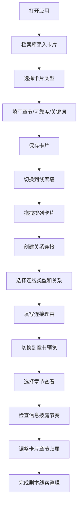

## 1. 产品概述

面向独立恐怖游戏编剧的桌面端线索墙工具，用于在剧本早期整理异常事件、目击证词和结局伏笔。通过可视化的卡片管理和关系连接，帮助编剧构建严谨的叙事结构，避免信息泄露或关键线索埋藏过深。

- **核心价值**：将抽象的剧本线索转化为可操作的视觉化工具，提升恐怖游戏叙事的逻辑性和沉浸感
- **目标用户**：独立恐怖游戏编剧、叙事设计师、剧本创作者
- **解决痛点**：传统文档难以追踪线索关联性，容易出现逻辑漏洞或节奏失衡

## 2. 核心功能

### 2.1 Feature Module

1. **档案库窗口**：卡片录入与管理，支持录音、照片、手记、失踪报告等类型
2. **线索墙窗口**：卡片可视化展示与关系拖拽，支持多种连接类型和标注
3. **章节预览窗口**：按章节筛选线索，检查信息披露节奏

### 2.2 Page Details

| 窗口名称 | 模块名称 | 功能描述 |
|---------|---------|----------|
| 档案库 | 卡片列表 | 展示所有线索卡片，支持按类型、章节、可靠度筛选 |
| 档案库 | 新建卡片 | 选择卡片类型（录音/照片/手记/失踪报告），填写章节、可靠程度、恐怖氛围关键词、详细内容 |
| 档案库 | 卡片编辑 | 修改卡片信息，支持拖拽添加到线索墙 |
| 线索墙 | 卡片展示 | 自由拖拽排列卡片，支持缩放和全景查看 |
| 线索墙 | 关系连接 | 三种连线类型（红线/虚线/污染线），四种关系标注（因果/误导/同源/未确认） |
| 线索墙 | 悬停提示 | 鼠标悬停连线时显示连接理由和关系说明 |
| 章节预览 | 章节选择 | 下拉选择特定章节，筛选该章节应披露的线索 |
| 章节预览 | 信息检查 | 高亮显示提前泄露的线索和埋藏过深的关键线索 |

## 3. 核心流程

### 3.1 用户主流程

编剧打开应用后，首先在档案库录入所有线索卡片，填写类型、章节、可靠度等信息。然后切换到线索墙，将卡片拖拽排列，用不同类型的线连接相关卡片并标注关系。最后在章节预览中逐章检查，确保线索披露节奏合理，没有逻辑漏洞。

### 3.2 流程图

## 4. 用户界面设计

### 4.1 设计风格

- **主色调**：深炭灰 (#1a1a1e) 为背景，暗血红 (#8b0000) 为强调色，冷灰蓝 (#2d3748) 为辅助色
- **字体**：标题使用 "Cinzel" 衬线字体（复古严肃感），正文使用 "IBM Plex Mono" 等宽字体（档案感）
- **按钮风格**：微立体、直角边框、轻微内阴影，悬停时显示暗红色边框
- **布局风格**：三窗口可停靠布局，支持拖拽分离和合并
- **视觉细节**：微妙的噪点纹理背景、胶片颗粒效果、卡片边缘磨损效果

### 4.2 Page Design Overview

| 窗口名称 | 模块名称 | UI Elements |
|---------|---------|-------------|
| 档案库 | 顶部工具栏 | 新建按钮、筛选下拉、搜索框、暗色/更暗主题切换 |
| 档案库 | 卡片列表 | 网格布局，卡片显示类型图标、标题、章节标签、可靠度指示器 |
| 档案库 | 编辑面板 | 右侧滑出式表单，包含类型选择器、章节输入、可靠度滑块、关键词标签、多行内容输入 |
| 线索墙 | 画布区域 | 无限画布，支持缩放平移，深纹理背景，网格参考线可选 |
| 线索墙 | 卡片组件 | 带阴影的实体卡片，类型颜色区分，支持拖拽，选中时边框发光 |
| 线索墙 | 连线系统 | SVG 绘制的贝塞尔曲线，悬停时加粗并显示 tooltip |
| 线索墙 | 工具栏 | 缩放控制、网格切换、自动排列、清除连线 |
| 章节预览 | 时间轴 | 顶部章节时间轴，可点击跳转，高亮当前章节 |
| 章节预览 | 线索展示区 | 半透明显示非当前章节线索，当前章节线索完全显示 |
| 章节预览 | 检查报告 | 底部信息面板，显示潜在问题列表（提前泄露/埋藏过深） |

### 4.3 交互与动画

- **卡片入场**：从档案库拖拽到线索墙时有轻微弹跳和阴影加深效果
- **连线创建**：拖拽时显示虚线预览，释放后动画绘制完整连线
- **章节切换**：淡入淡出过渡，非当前章节卡片逐渐变为半透明
- **悬停效果**：卡片轻微上浮，连线发光增强，tooltip 淡入显示
- **错误提示**：违规线索卡片边缘脉冲式红光闪烁

### 4.4 响应式

- 桌面端优先设计，支持窗口大小自适应
- 三窗口布局支持拖拽调整大小
- 最小支持分辨率：1280x800
