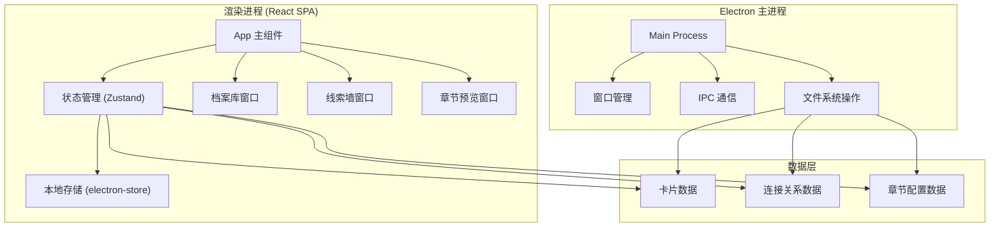
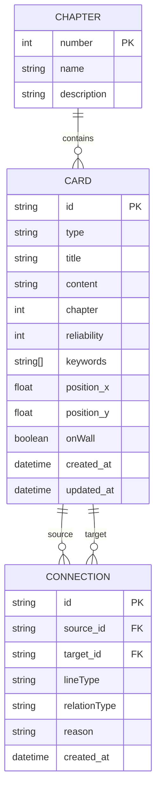

## 1. 架构设计



## 2. 技术描述

- **前端框架**：React@18 + TypeScript + Vite@5
- **桌面框架**：Electron@28 + electron-builder
- **状态管理**：Zustand@4（轻量级，适合桌面应用）
- **样式方案**：TailwindCSS@3 + CSS 变量
- **数据持久化**：electron-store（JSON 文件存储）
- **拖拽交互**：@dnd-kit/core + @dnd-kit/sortable
- **图形绘制**：原生 SVG（用于连线绘制）
- **图标库**：Lucide React

## 3. 项目结构

```
.
├── electron/                    # Electron 主进程代码
│   ├── main.ts                 # 主进程入口
│   ├── preload.ts              # 预加载脚本
│   └── store.ts                # 文件存储封装
├── src/                        # 渲染进程代码
│   ├── components/             # 可复用组件
│   │   ├── Card.tsx            # 线索卡片组件
│   │   ├── Connection.tsx      # 连线组件
│   │   ├── Tooltip.tsx         # 悬浮提示组件
│   │   └── WindowFrame.tsx     # 窗口框架组件
│   ├── windows/                # 三个主窗口
│   │   ├── ArchiveLibrary/     # 档案库窗口
│   │   │   ├── ArchiveLibrary.tsx
│   │   │   ├── CardList.tsx
│   │   │   └── CardEditor.tsx
│   │   ├── ClueWall/           # 线索墙窗口
│   │   │   ├── ClueWall.tsx
│   │   │   ├── Canvas.tsx
│   │   │   └── ConnectionToolbar.tsx
│   │   └── ChapterPreview/     # 章节预览窗口
│   │       ├── ChapterPreview.tsx
│   │       ├── Timeline.tsx
│   │       └── InspectionReport.tsx
│   ├── store/                  # 状态管理
│   │   ├── useCardStore.ts
│   │   ├── useConnectionStore.ts
│   │   └── useChapterStore.ts
│   ├── types/                  # TypeScript 类型定义
│   │   ├── card.ts
│   │   ├── connection.ts
│   │   └── chapter.ts
│   ├── utils/                  # 工具函数
│   │   ├── drag.ts
│   │   ├── svg.ts
│   │   └── export.ts
│   ├── App.tsx
│   ├── main.tsx
│   └── index.css
├── public/                     # 静态资源
│   └── textures/               # 纹理图片
├── package.json
├── tsconfig.json
├── vite.config.ts
└── electron-builder.config.js
```

## 4. 数据模型

### 4.1 实体关系图



### 4.2 类型定义

```typescript
// 卡片类型
type CardType = 'recording' | 'photo' | 'note' | 'missing_report';

// 连线类型
type LineType = 'red' | 'dashed' | 'contaminated';

// 关系类型
type RelationType = 'causality' | 'misleading' | 'homology' | 'unconfirmed';

// 卡片接口
interface Card {
  id: string;
  type: CardType;
  title: string;
  content: string;
  chapter: number;
  reliability: number; // 0-100
  keywords: string[];
  position: { x: number; y: number };
  onWall: boolean;
  createdAt: Date;
  updatedAt: Date;
}

// 连接关系接口
interface Connection {
  id: string;
  sourceId: string;
  targetId: string;
  lineType: LineType;
  relationType: RelationType;
  reason: string;
  createdAt: Date;
}

// 章节接口
interface Chapter {
  number: number;
  name: string;
  description: string;
}

// 应用状态接口
interface AppState {
  cards: Card[];
  connections: Connection[];
  chapters: Chapter[];
  selectedCardId: string | null;
  selectedConnectionId: string | null;
  currentChapter: number | null;
  zoom: number;
  pan: { x: number; y: number };
}
```

## 5. 核心模块设计

### 5.1 档案库窗口模块

| 模块 | 职责 | 关键函数 |
|------|------|----------|
| 卡片列表 | 展示所有卡片，支持筛选排序 | `filterCards()`, `sortCards()` |
| 卡片编辑器 | 新建/编辑卡片信息 | `createCard()`, `updateCard()`, `deleteCard()` |
| 拖拽源 | 将卡片拖拽到线索墙 | `handleDragStart()` |

### 5.2 线索墙窗口模块

| 模块 | 职责 | 关键函数 |
|------|------|----------|
| 无限画布 | 支持平移缩放，渲染卡片和连线 | `handleZoom()`, `handlePan()`, `renderCanvas()` |
| 卡片放置 | 处理卡片拖拽放置和移动 | `handleCardDrop()`, `handleCardMove()` |
| 连线系统 | 创建、编辑、删除连接关系 | `startConnection()`, `endConnection()`, `updateConnection()` |
| 交互处理 | 卡片选中、悬停、右键菜单 | `handleCardSelect()`, `handleConnectionHover()` |

### 5.3 章节预览窗口模块

| 模块 | 职责 | 关键函数 |
|------|------|----------|
| 章节时间轴 | 展示所有章节，支持切换 | `selectChapter()`, `renderTimeline()` |
| 线索过滤 | 根据章节筛选可见线索 | `filterByChapter()`, `getVisibleCards()` |
| 检查报告 | 分析信息泄露和埋藏问题 | `checkLeaks()`, `checkDeepBuried()`, `generateReport()` |

## 6. IPC 通信设计

```typescript
// 主进程暴露的 API
interface ElectronAPI {
  // 数据持久化
  saveData: (data: AppState) => Promise<void>;
  loadData: () => Promise<AppState | null>;
  exportProject: (format: 'json' | 'pdf') => Promise<string>;
  importProject: () => Promise<AppState | null>;
  
  // 窗口操作
  createDetachedWindow: (windowType: string) => Promise<void>;
  setAlwaysOnTop: (flag: boolean) => void;
  
  // 系统交互
  openExternal: (url: string) => void;
  showMessageBox: (options: any) => Promise<number>;
}
```

## 7. 构建与发布

- **开发模式**：Vite 开发服务器 + Electron 热重载
- **生产构建**：electron-builder 打包为 Windows 安装包
- **自动更新**：electron-updater（可选）
- **CI/CD**：GitHub Actions 自动构建发布
